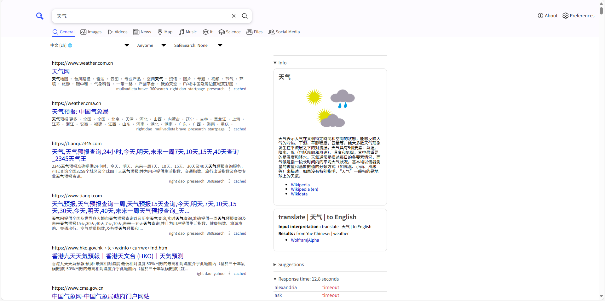
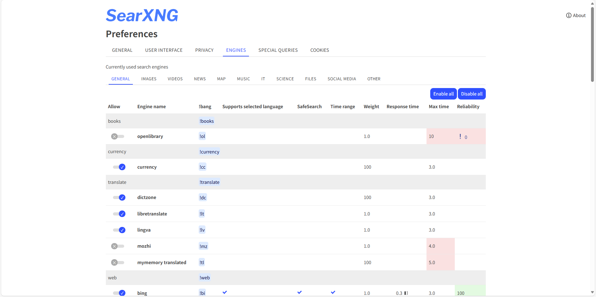
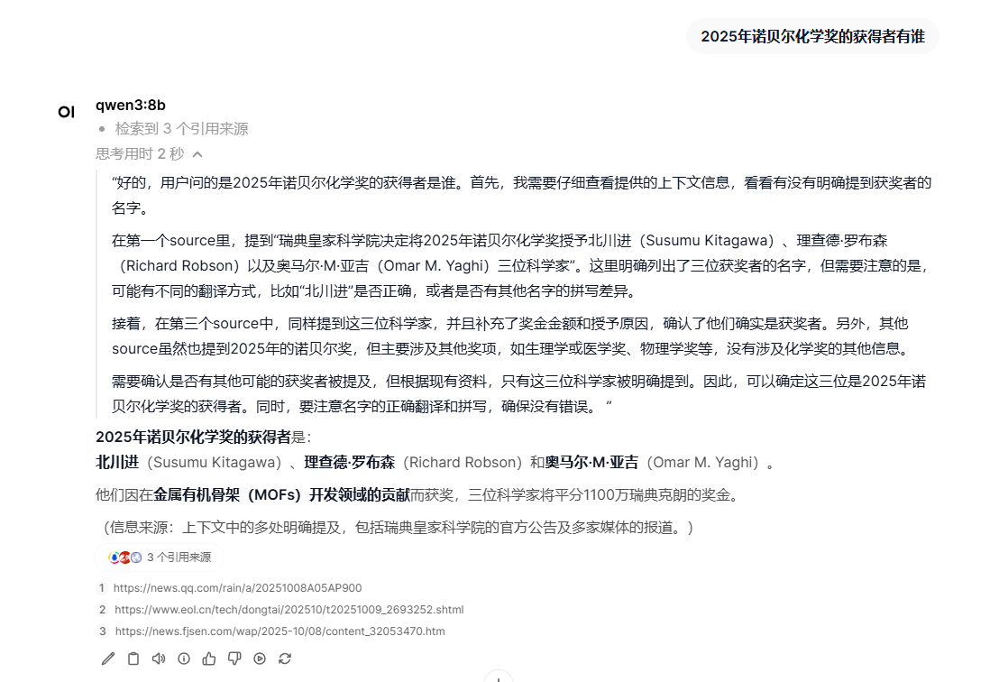
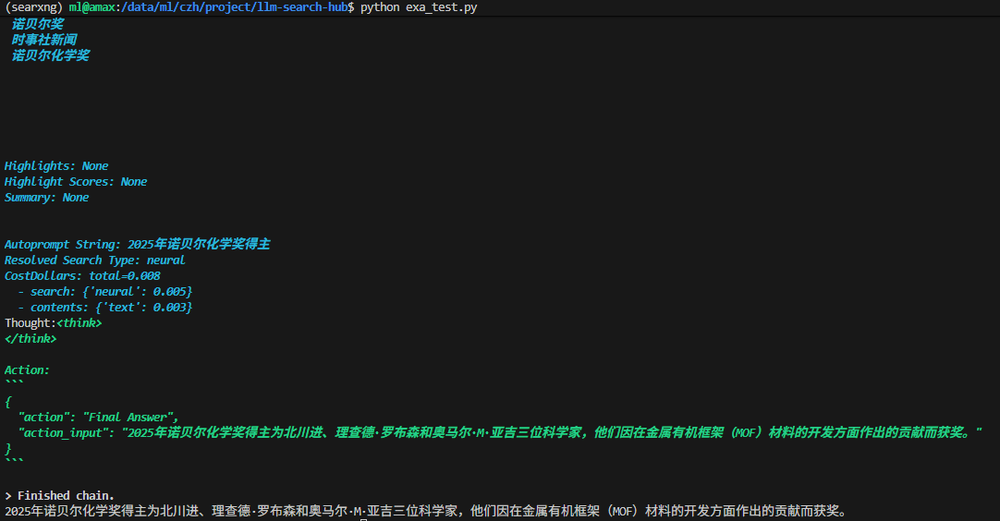

# llm-search-hub

## 介绍

大语言模型的联网搜索并不是一开始就自带的，而是一种增强式方案。这个方案的流程如下：
```
用户提问 → 模型判断是否需要最新信息 → 自动调用搜索引擎 API → 把返回的网页/摘要注入上下文 → 模型再组织答案并给出引用。
```

### 实现方式

目前的实现方式主要是两种：
- 官方网页：主流的大模型网页中，对话框都带又一个联网搜索的开关按钮，可以直接在对话框中选择是否开启联网搜索功能。
- 自建方案：Google、Bing等搜索引擎又相关的API，可以将其封装成Tool，让模型自己在框架中运用。

### 优点
- 实时性：突破“知识截止”限制，可回答今日天气、股价、赛事比分等动态信息。
- 准确性：先检索再生成，显著降低幻觉率，专业事实类问答准确率又显著提升。
- 深度问答：对多跳、多源问题（如“对比 2025Q2 中韩芯片出口政策”）可自动拆分关键词、整合多篇最新报道，给出结构化结论。
- 可溯源：答案末尾列出引用链接，方便用户一键验证，提升信任度。

本文具体采用ollama部署本地模型环境、SearXNG部署私有化联网搜索工具、（LangChain智能体搭建）  

## 实现步骤(从0搭建)

### 安装&配置ollama(非sudo)

#### 安装

由于没有sudo权限，所以我们主要通过安装包安装

```bash
mkdir ~/project/ollama  # 前提是有project目录

cd ~/project/ollama

wget -O ollama-linux-amd64.tgz https://ollama.com/download/ollama-linux-amd64.tgz  # 在没有VPN的情况下，服务器下载速度极慢，可以在Windows打开VPN本地下载，然后传到服务器(文件大小1.8G)

tar -xvzf ollama-linux-amd64.tgz  # 解压压缩包，解压后只有bin和lib文件夹

cd bin  # ollama服务文件所在目录

./ollama serve  # 启动服务，出现多条【time=2025-10-09T10:07:54.342+08:00 level=INFO...】后说明启动成功
```

启动新终端输入`~/project/ollama/bin/ollama -v`可以查看版本号

#### 设置环境变量

如果每次启动都要到对应的目录去启动就太麻烦了，因此设置环境变量后，就可以直接启动ollama服务

```bash
vim ~/.bashrc

# 添加内容
export OLLAMA_HOME=改为自己的目录
export PATH=$PATH:$OLLAMA_HOME

# 退出保存后，使环境变量生效
source ~/.bashrc

# 启动服务
ollama serve
```
**后续内容均认为配置好环境变量**

#### 模型下载

截至2025年10月9日，我们就以比较新的模型去下载：qwen3-8b（暂时不用太大的模型）  

官网地址：https://ollama.com/library/qwen3:8b

终端输入`ollama run qwen3:8b`就开始下载模型，并运行模型  
`ollama list`查看下载的模型列表

### 联网搜索组件SearXNG

SearXNG是一个开源的、注重隐私的元搜索引擎，基于原始的 Searx 项目进行改进和优化。它允许用户从多个搜索引擎中获取结果，同时避免被单一搜索引擎追踪。  

(无root、sudo、docker-compose、外网权限，这一步很难配置)  

以下内容通过git进行配置（conda环境要3.9及以上）  

```bash
# 克隆SearXNG
git clone https://github.com/searxng/searxng.git

# 安装依赖
cd searxng
pip install -r requirements.txt
pip install searxng

# searx/settings.yml是SearXNG的配置文件，我们需要将其复制到项目根目录中（暂时不配置，先做到正常启动）
cp ./searx/webapp.py ./

# 启动SearXNG
python ./searx/webapp.py 
```

启动SearXNG后，可能会出现`ModuleNotFoundError: No module named 'searx'`的错误，需要将webapp.py复制到项目根目录启动

```bash
cp ./searx/webapp.py ./
python webapp.py 
```

如果出现`ERROR:searx.webapp: server.secret_key is not changed. Please use something else instead of ultrasecretkey.`的错误，则进行以下步骤：
```bash
openssl rand -base64 32  # 随机生成字符串，替换settings.yml中server.secret_key内容
```

终端显示以下文本时表示项目已经正常启动了。
```
 * Serving Flask app 'webapp'
 * Debug mode: off
```

**配置SearXNG**

在settings.yml文件中，engines是所有支持的搜索引擎，默认很多都是禁用的，也就是`disabled: true`，可以批量修改文件，设置`disabled: true`为`disabled: false`。



还可以通过可视化界面来设置支持的搜索引擎。



端口号修改
```yml
server:
  # Is overwritten by ${SEARXNG_PORT} and ${SEARXNG_BIND_ADDRESS}
  port: 8888  # 根据需求修改，默认8888
  bind_address: "0.0.0.0"  # 设置成0.0.0.0就可以外网连接服务器的SearXNG
```

### 前端UI

Open WebUI 是一款开源的 UI 开发工具，通过可视化的拖拽界面，帮助开发人员在浏览器中即时构建和测试网页 UI。开发者无需繁琐的编码过程，即可实时查看界面元素的变化效果。

#### 安装

安装的方式有多种，例如docker、git、pip都可以安装，个人认为最简单最快的是pip安装  

```bash
# 创新conda环境
conda create -n searxng python=3.11 -y  # 最好是3.9以上的版本，3.14一下的版本
conda activate searxng

# 安装Open WebUI相关库
pip install open-webui --break-system-packages --ignore-installed

# 运行Open WebUI，不写port默认是8080端口，这个端口容易被占用，运行后可以在网址输入 ip:9999访问前端页面
open-webui serve --port 9999
```

### 基于前端可视化设置实现联网搜索

webui启动后，可以通过ip:9999访问前端页面，第一次启动会注册管理员。  

通过设置->管理员设置->联网搜索  
就可以展示出可视化的联网搜索设置界面，可以选择一些引擎来实现联网搜索。  

> 一下搜索以"2025年获得诺贝尔化学奖的人有谁"为例

#### 谷歌
相关网址：https://programmablesearchengine.google.com/  
开启个人搜索引擎后，需要复制【搜索引擎id】和【Custom Search JSON API Key】
- 免费次数：100次/天
- 超额费用：每1000次5美元
- 查询上限：10000次/天

查询信息：
```python
{'title': '三名科学家因金属有机框架研究获2025年诺贝尔化学奖-新华网', 'link': 'http://www.news.cn/world/20251008/69e81599204643f8b5e28d23ec21eef9/c.html', 'snippet': '3 days ago ... 据介绍，在三名获奖者的突破性发现之后，化学家们构建了数以万计不同种类的金属有机框架材料，其中一些材料可能有助于解决人类面临的很多重大挑战。 诺贝尔\xa0...'}
```

#### DDGS
DDGS是一个用于从 DuckDuckGo 获取搜索结果的 Python 类，来自第三方库（duckduckgo-search）。这个类封装了与 DuckDuckGo 搜索引擎的交互逻辑，使得开发者可以方便地通过代码获取搜索结果。  
但是会有An error occurred while searching the web错误，网上的解决方式是换一个引擎。  
根据网上的资料：
- 免费无限制
- 但是搜索内容不全面

#### 博查
官网：https://open.bochaai.com  
他们宣称的主旨是“为AI产业提供世界知识搜索服务”，上线60天，已经被AI调用超过30万次。  
主要客户是：腾讯元器、字节扣子、钉钉AI助理  
用户需要购买资源包，并新建API KEY（API KEY的内容只显示一次，需要妥善保存好），即可调用API。  
- 免费次数1000次（购买免费资源包后只有3个月有效时间，且一个用户只限购1次免费资源包）
- 资源类型分web search api（只有这个有免费的）和ai search api，具体购买余额从官网中查询：https://open.bochaai.com/package/purchase
- 比较适用于国内环境

#### exa
Exa.ai官网：https://exa.ai  
专为增强人工智能应用而设计，提供神经搜索和关键词搜索功能。它在精准和相关的网页内容查找、自动化研究以及创建专门的数据集方面表现出色。与传统搜索引擎如谷歌不同，Exa 使用基于 Transformer 的模型来理解查询的上下文和含义，从而返回更准确和相关的结果。
网上资料显示：
- 免费次数为1000次/月
- 国内搜索相对较少，比较使用国外的环境。
- 付费相关信息查询：https://dashboard.exa.ai/billing

#### SearXNG
配置SearXNG，可以实现多引擎搜索。
SearXNG查询URL为`http://localhost:8888/search?q=<query>`
其中`search?q=<query>`是必须要填入的。
- 免费开源
- 多引擎配置

## 最终结果展示

### 前端Open WebUI界面


### 终端联网搜索界面

